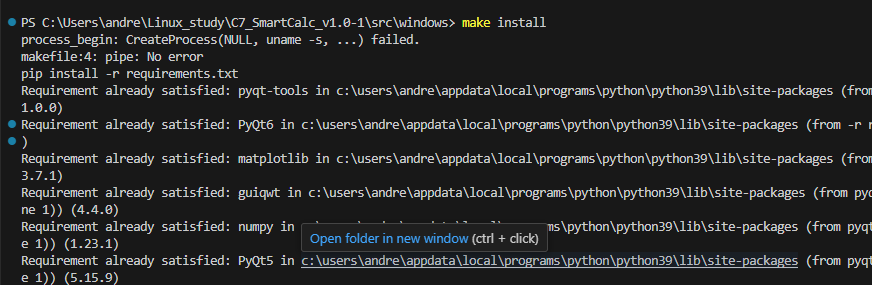
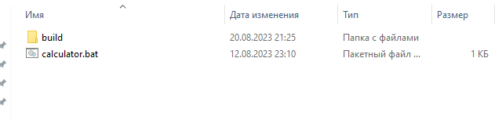
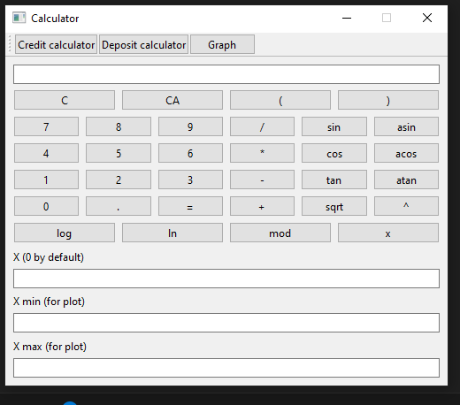
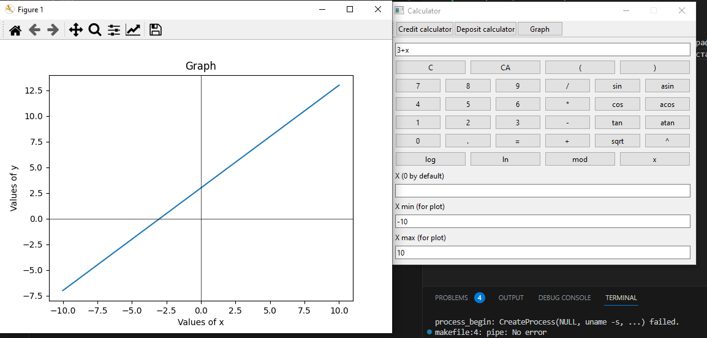
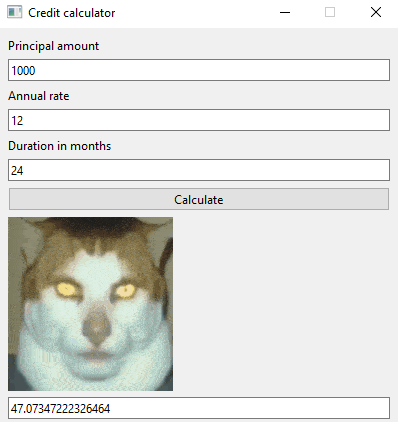
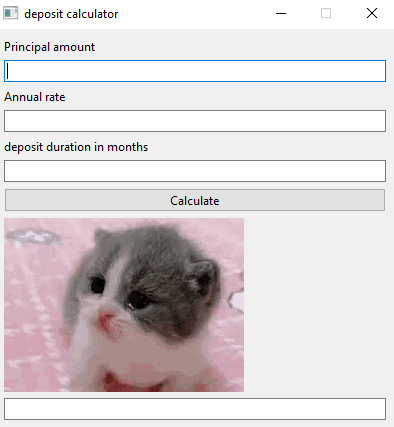

# SmartCalc v1.0
- чтобы установить калькулятор надо ввести 'make install' в директории с названием OS

- в директории src будет calculator, чтобы запустить калькулятор надо открыть calculator.bat

- С (clear) чтобы стереть 1 символ
- СА (clear all) отчистить всю строку 
- Х (by default 0) задать значение х
- Х минимальный и максимальный можно задать для графика (по умолчанию PI) 
- Graph работает только если в строке есть x (константные выражения не рисуются)

## BONUS

- ВВедите общую часть, годовые проценты и количество месяцев(ответ будет сколько в месяц нужно платить чтобы погасить кредит)

- ВВедите общую часть, годовые проценты и количество месяцев(ответ будет доход по окончанию месяцев депозита с учетомпроцентов в месяц)